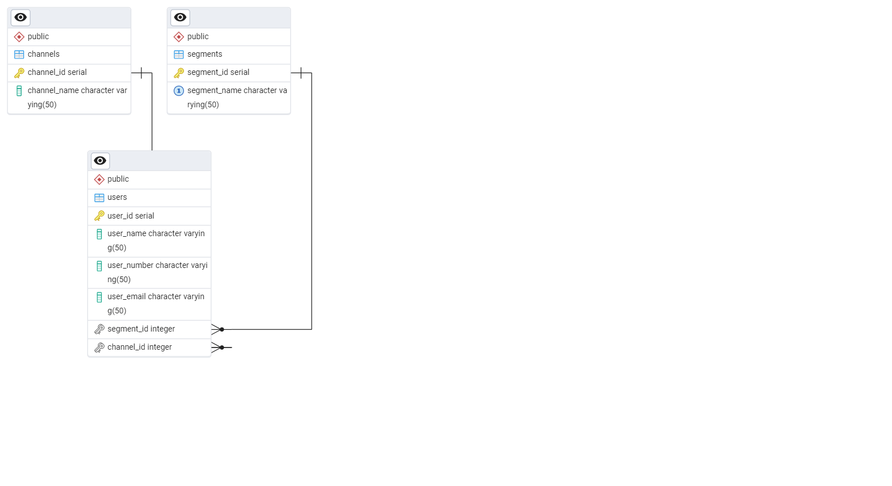

# CRM Data Engagement Analysis

This project simulates a simple Customer Relationship Management (CRM) system to analyze user engagement across different communication channels and marketing segments.

## 📊 Project Overview

- Simulates user data (500 users)
- 3 Communication Channels: Email, SMS, WhatsApp
- 5 Segments: Open Rate, Click Rate, Conversion Rate, Unsubscribe Rate, Inbox Placement
- Performs SQL-based analysis on conversion and open rates
- Supports dashboarding with Excel

## 📌 ER Diagram



## 🔧 Setup

1. Run `CRM_data_generation_script.sql` in PostgreSQL to create and populate the tables.
2. Use `SQL_queries_to_extract_data.sql` to analyze the user engagement by channel/segment.
3. Visualize insights using `CRM_Dashboard.xlsx`.

## 📈 Analysis Highlights

- Which channel performs best in conversions
- Segment-wise performance across channels
- Conversion heatmaps and summary metrics

## 💡 Sample SQL Output

```sql
SELECT DISTINCT c.channel_name AS Channel, COUNT(*) AS Engagement
FROM users u
JOIN channels c ON u.channel_id=c.channel_id
GROUP BY c.channel_id;
```

## 📂 Files Included

| File                          | Description                                      |
|------------------------------|--------------------------------------------------|
| `CRM_data_generation_script.sql` | Script to create & populate the CRM database     |
| `SQL_queries_to_extract_data.sql` | SQL queries for engagement & conversion analysis |
| `CRM_Dashboard.xlsx`         | Excel dashboard for visualization                |
| `ERD_FOR_CRM_DATASET.png`    | Entity Relationship Diagram for the schema       |

## 👨‍💻 Author

**Chaitanya Krishna Kommineni**  
[LinkedIn](https://www.linkedin.com/in/kchaitanya17/)  
[Portfolio](https://ckommineni01.github.io/chaitanya-portfolio/)
